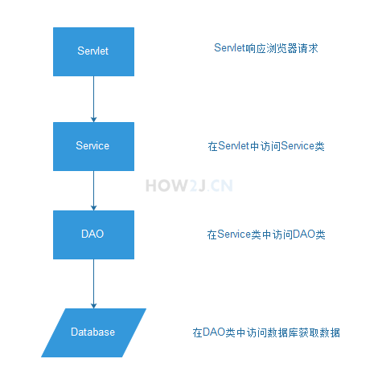

# Service层
## 1.流程
作为J2EE web 应用，一般会按照如图所示的设计流程进行
Servlet -> Service（业务类） -> DAO -> database

当浏览器提交请求到tomcat web 服务器的时候，对应的servlet的doGet/doPost方法会被调用，接着在servlet中调用Service类，然后在Service类中调用DAO类，最后在DAO中访问数据库获取相应的数据。

## 2.不使用service层原因
模仿天猫整站-J2ee 版本中，不使用Service这一层。 原因是在DAO进行了比较详细的设计，已经提供了很好的支持业务的方法。

所以在本项目，取消了Service业务类这一层。